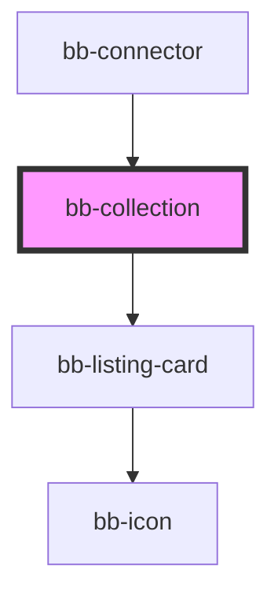

# bb-collection

<!-- Auto Generated Below -->

## Properties

| Property                   | Attribute                    | Description | Type                             | Default                |
| -------------------------- | ---------------------------- | ----------- | -------------------------------- | ---------------------- |
| `collectionFilters`        | `collection-filters`         |             | `string`                         | `'manufacturer,model'` |
| `collectionHeader`         | `collection-header`          |             | `"image" \| "none" \| "overlay"` | `'overlay'`            |
| `collectionList`           | `collection-list`            |             | `"card" \| "overlay"`            | `'overlay'`            |
| `collectionLocationFilter` | `collection-location-filter` |             | `string`                         | `'All Locations'`      |
| `collectionPath`           | `collection-path`            |             | `string`                         | `undefined`            |
| `collectionProfileFilter`  | `collection-profile-filter`  |             | `string`                         | `'All Profiles'`       |
| `root`                     | `root`                       |             | `string`                         | `'/'`                  |

## Dependencies

### Used by

 - [bb-connector](../bb-connector)

### Depends on

- [bb-listing-card](../bb-listing-card)

### Graph

----------------------------------------------

*Built with [StencilJS](https://stenciljs.com/)*
