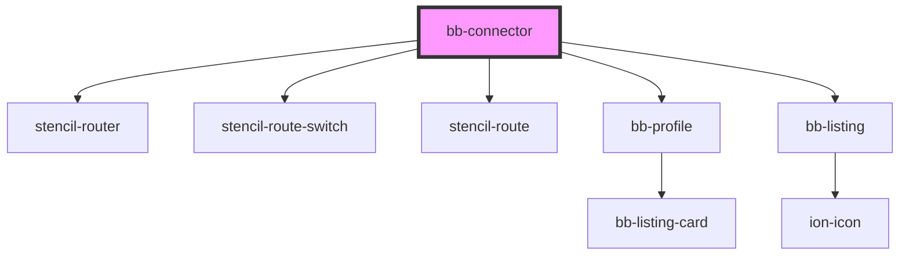

# bb-connector

<!-- Auto Generated Below -->

## Properties

| Property | Attribute | Description | Type     | Default |
| -------- | --------- | ----------- | -------- | ------- |
| `base`   | `base`    |             | `string` | `''`    |
| `mode`   | `mode`    |             | `string` | `''`    |
| `path`   | `path`    |             | `string` | `''`    |
| `root`   | `root`    |             | `string` | `''`    |

## Dependencies

### Depends on

- stencil-router
- stencil-route-switch
- stencil-route
- [bb-profile](../bb-profile)
- [bb-listing](../bb-listing)

### Graph

----------------------------------------------

*Built with [StencilJS](https://stenciljs.com/)*
