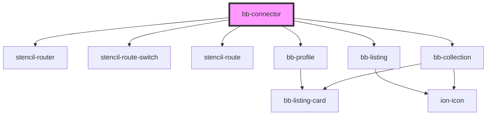

# bb-connector

<!-- Auto Generated Below -->

## Properties

| Property | Attribute | Description                                          | Type                                     | Default     |
| -------- | --------- | ---------------------------------------------------- | ---------------------------------------- | ----------- |
| `base`   | `base`    | The base component type to start the routing from.   | `"collection" \| "listing" \| "profile"` | `undefined` |
| `mode`   | `mode`    | The history mode to use for navigation.              | `"browser" \| "hash"`                    | `'browser'` |
| `path`   | `path`    | The path or id of the base type you want to display. | `string`                                 | `undefined` |
| `root`   | `root`    | The root for mapping urls e.g. /custompath .         | `string`                                 | `''`        |

## Dependencies

### Depends on

- stencil-router
- stencil-route-switch
- stencil-route
- [bb-profile](../bb-profile)
- [bb-listing](../bb-listing)
- [bb-collection](../bb-collection)

### Graph

----------------------------------------------

*Built with [StencilJS](https://stenciljs.com/)*
