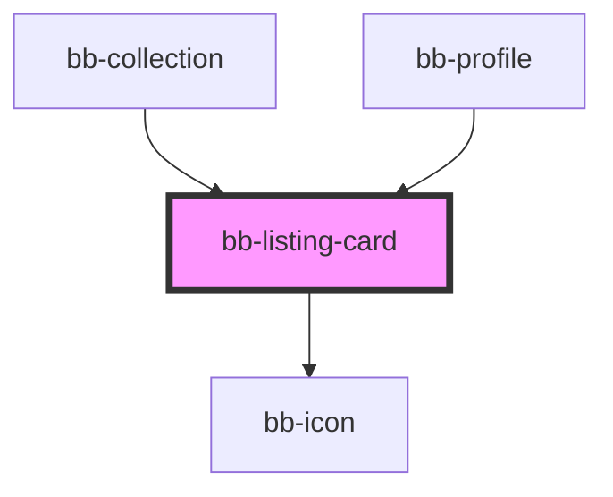

# bb-listing-card

<!-- Auto Generated Below -->

## Properties

| Property      | Attribute      | Description | Type                            | Default     |
| ------------- | -------------- | ----------- | ------------------------------- | ----------- |
| `display`     | `display`      |             | `"card" \| "list" \| "overlay"` | `'overlay'` |
| `listingData` | `listing-data` |             | `any`                           | `undefined` |
| `listingId`   | `listing-id`   |             | `string`                        | `undefined` |
| `root`        | `root`         |             | `string`                        | `'/'`       |

## Events

| Event       | Description | Type               |
| ----------- | ----------- | ------------------ |
| `linkClick` |             | `CustomEvent<any>` |

## Dependencies

### Used by

 - [bb-collection](../bb-collection)
 - [bb-profile](../bb-profile)

### Depends on

- [bb-icon](../icon)

### Graph

----------------------------------------------

*Built with [StencilJS](https://stenciljs.com/)*
