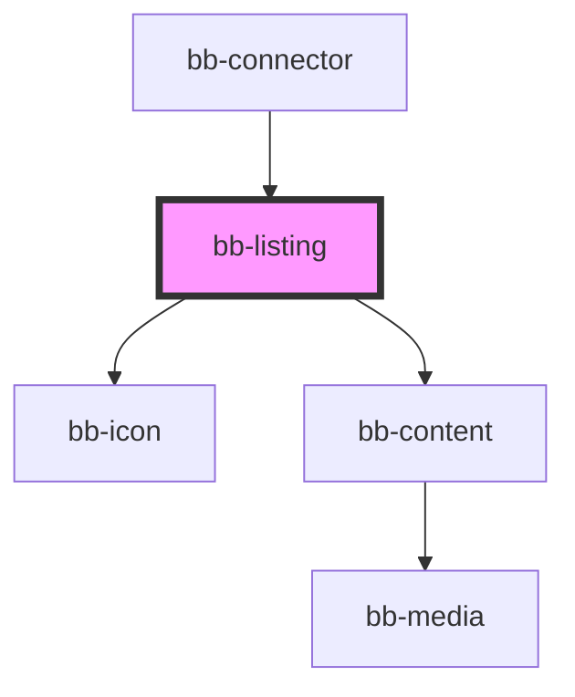

# bb-listing

<!-- Auto Generated Below -->

## Properties

| Property        | Attribute        | Description | Type     | Default                        |
| --------------- | ---------------- | ----------- | -------- | ------------------------------ |
| `canonicalRoot` | `canonical-root` |             | `string` | `'https://www.boaterbase.com'` |
| `listingPath`   | `listing-path`   |             | `string` | `undefined`                    |
| `root`          | `root`           |             | `string` | `'/'`                          |

## Events

| Event       | Description | Type               |
| ----------- | ----------- | ------------------ |
| `linkClick` |             | `CustomEvent<any>` |

## Dependencies

### Used by

 - [bb-connector](../bb-connector)

### Depends on

- [bb-icon](../icon)
- [bb-content](../content)

### Graph

----------------------------------------------

*Built with [StencilJS](https://stenciljs.com/)*
